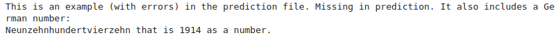
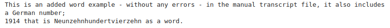
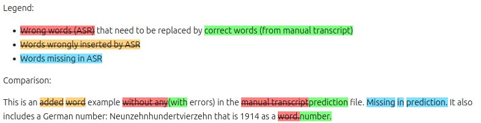

# German ASR postprocessing and evaluation

Code for comparing German ASR results to a ground truth transcription, including:

- postprocessing of numbers
- removal of punctuation
- visualization of errors (insertions, deletions, substitutions)

## Usage

See [compare.ipynb](compare.ipynb) for usage

## Example

* Ground-truth text: 
  

* Predicted text:
  

* Visualization:
  
